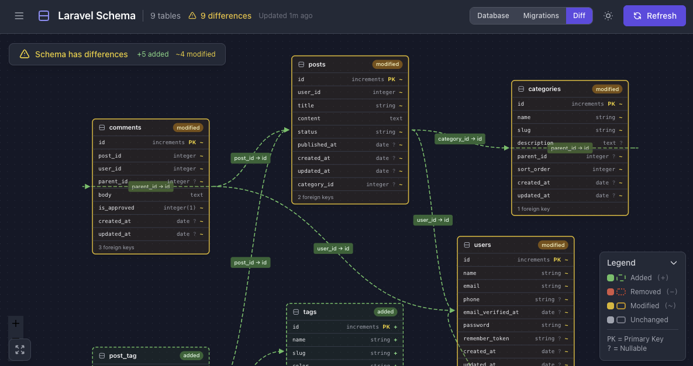

# Laravel Schema

[](https://packagist.org/packages/farzai/laravel-schema)
[](https://github.com/parsilver/laravel-schema/actions?query=workflow%3Arun-tests+branch%3Amain)
[](https://github.com/parsilver/laravel-schema/actions?query=workflow%3A"Fix+PHP+code+style+issues"+branch%3Amain)
[](https://packagist.org/packages/farzai/laravel-schema)

A Laravel package for visualizing and comparing database schemas. View your database structure through an interactive ER diagram dashboard and identify differences between your migration files and actual database state.

Similar to Laravel Horizon and Telescope, it provides a beautiful web interface for schema inspection. **This package is view-only** — it detects and visualizes differences but does not generate or apply migrations.



## Features

- **Interactive ER Diagram** — Visualize your database schema with React Flow
- **Schema Comparison** — Compare migrations vs actual database state
- **Multi-Database Support** — MySQL, PostgreSQL, SQLite, and SQL Server
- **Diff Detection** — See added, removed, and modified tables/columns at a glance
- **REST API** — Programmatic access to schema data
- **Gate-based Authorization** — Secure access similar to Horizon/Telescope
- **Dark Mode** — Beautiful dark theme out of the box

## Requirements

- PHP 8.4+
- Laravel 11.x or 12.x

## Installation

Install the package via Composer:

```bash
composer require farzai/laravel-schema
```

Publish the configuration file:

```bash
php artisan vendor:publish --tag=laravel-schema-config
```

Publish the frontend assets:

```bash
php artisan vendor:publish --tag=laravel-schema-assets
```

## Configuration

The configuration file will be published to `config/schema.php`:

```php
return [
    // Subdomain for Laravel Schema (optional)
    'domain' => env('SCHEMA_DOMAIN'),

    // URI path where the dashboard is accessible
    'path' => env('SCHEMA_PATH', 'schema'),

    // Route middleware
    'middleware' => ['web'],

    // Authorization settings
    'authorization' => [
        'enabled' => true,
        'gate' => 'viewLaravelSchema',
    ],

    // Path to migrations directory
    'migrations_path' => 'database/migrations',

    // Database connection (null = default)
    'connection' => null,

    // Tables to ignore during comparison
    'ignored_tables' => [
        'migrations',
        'password_reset_tokens',
        'sessions',
        'cache',
        'cache_locks',
        'jobs',
        'job_batches',
        'failed_jobs',
    ],
];
```

## Authorization

By default, Laravel Schema is only accessible in the `local` environment. To configure access in other environments, define authorization logic in your `AppServiceProvider`:

```php
use Farzai\LaravelSchema\SchemaInspector;

public function boot(): void
{
    SchemaInspector::auth(function ($request) {
        return app()->environment('local') ||
               in_array($request->user()?->email, [
                   'admin@example.com',
               ]);
    });
}
```

## Dashboard

Once installed, access the dashboard at:

```
http://your-app.test/schema
```

The dashboard provides:
- **ER Diagram** — Interactive visualization of your database tables and relationships
- **Schema Differences** — Visual indicators for added, removed, and modified schema elements
- **Table Details** — Column types, indexes, and foreign key information
- **Legend** — Color-coded guide for understanding diff status

## API Endpoints

Laravel Schema exposes a REST API for programmatic access:

| Method | Endpoint | Description |
|--------|----------|-------------|
| GET | `/schema` | Dashboard (React SPA) |
| GET | `/schema/api/tables` | List all database tables |
| GET | `/schema/api/tables/{table}` | Get specific table details |
| GET | `/schema/api/diff` | Full schema comparison |
| GET | `/schema/api/diff/{table}` | Table-specific diff |
| GET | `/schema/api/migrations` | List migration files |
| GET | `/schema/api/status` | Schema sync status summary |
| POST | `/schema/api/refresh` | Force schema refresh |

## Testing

```bash
composer test
```

Run tests with coverage:

```bash
composer test-coverage
```

## Changelog

Please see [CHANGELOG](CHANGELOG.md) for more information on what has changed recently.

## Contributing

Please see [CONTRIBUTING](CONTRIBUTING.md) for details.

## Security Vulnerabilities

Please review [our security policy](../../security/policy) on how to report security vulnerabilities.

## Credits

- [parsilver](https://github.com/parsilver)
- [All Contributors](../../contributors)

## License

The MIT License (MIT). Please see [License File](LICENSE.md) for more information.
